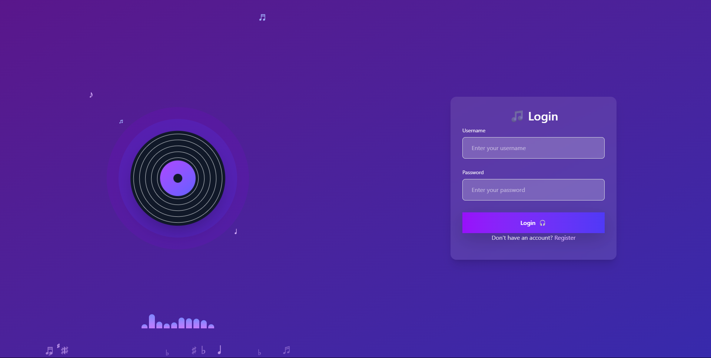
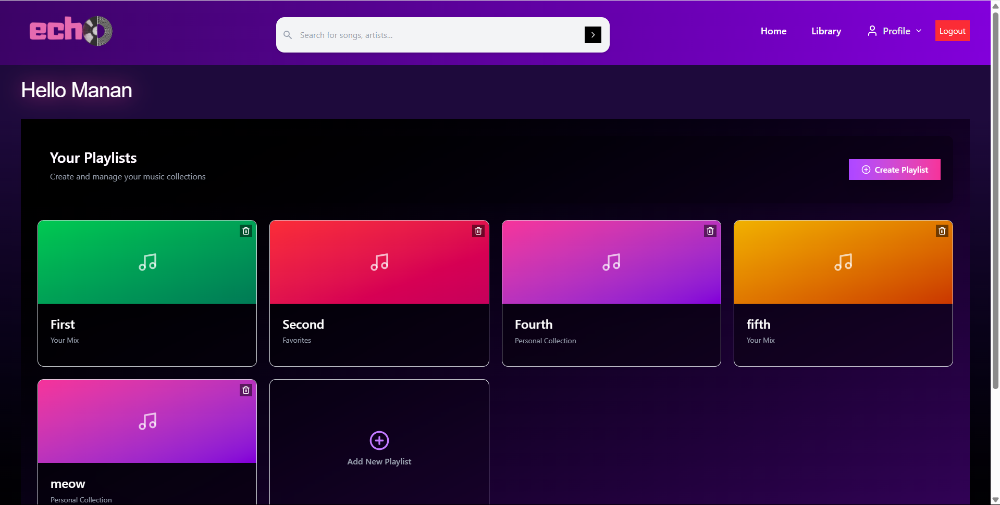
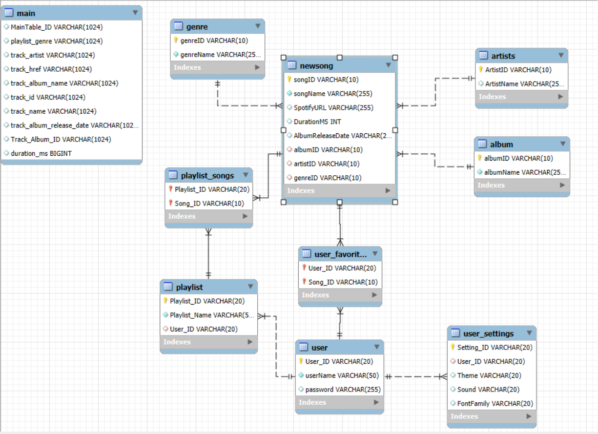
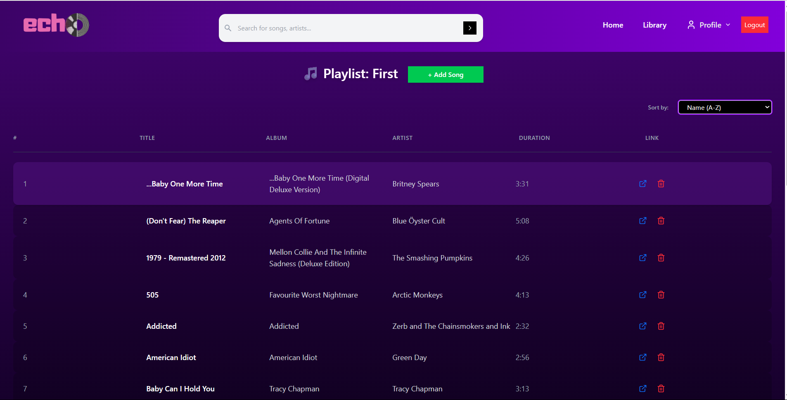
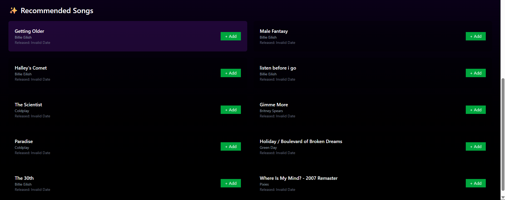
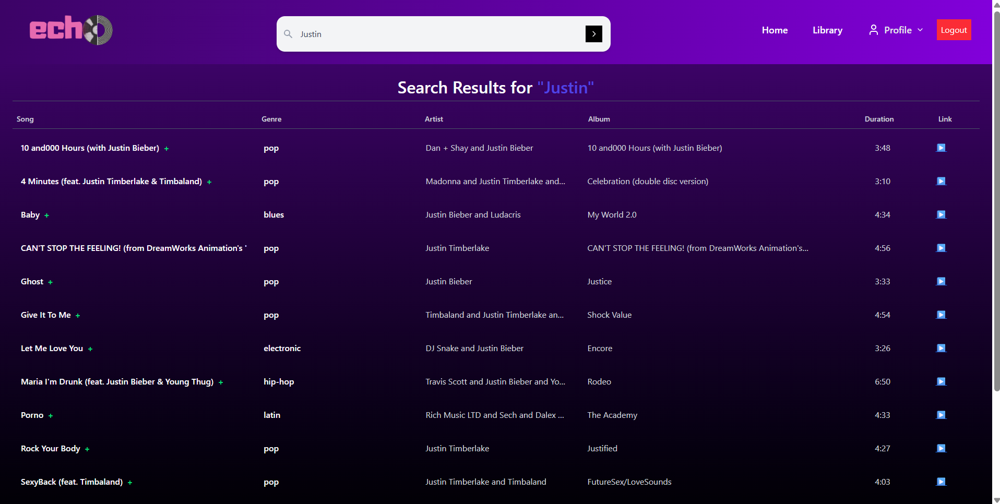
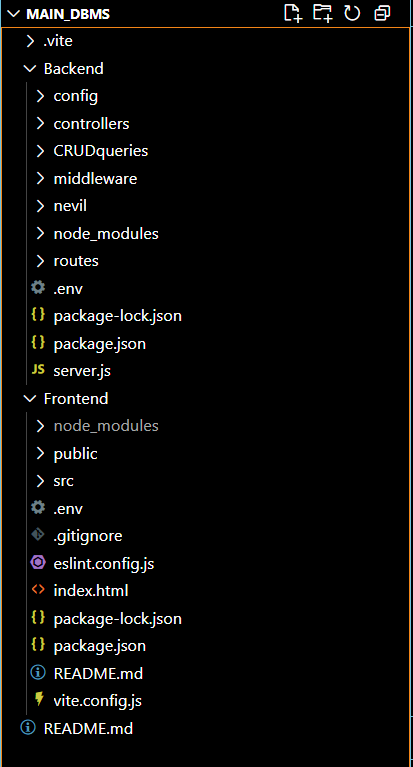

# 🎶 Echo – Music Playlist Web App

**Echo** is a full-stack music playlist web application that lets users create, manage, and enjoy custom music playlists. Built with modern technologies, Echo offers a secure, responsive, and user-friendly experience.




---

## 🧩 Tech Stack

**Frontend**
- ⚛️ React.js
- 💨 Tailwind CSS




**Backend**
- 🟩 Node.js
- 🚂 Express.js
- 🔐 JWT (JSON Web Tokens)
- 🍪 cookie-parser
- 🔑 bcrypt

**Database**
- 🐬 MySQL
- 
- ## 📊 Dataset & Database Design

- The dataset used for Echo was sourced from [Kaggle](https://www.kaggle.com/), containing metadata about songs, artists, genres, and more.
- We **normalized the dataset into 10–11 relational tables**, following **Third Normal Form (3NF)** to reduce redundancy and ensure data integrity.
- Key tables include:
  - `users`
  - `songs`
  - `artists`
  - `albums`
  - `genres`
  - `playlists`
  - `playlist_songs` (many-to-many mapping)
  - and others for managing authentication and user preferences.

This structured design improves query performance, makes the schema scalable, and ensures clear separation of concerns across entities.


---




## 🔐 Features

- User authentication (JWT & secure cookies)
- Password hashing using bcrypt
- Custom playlist creation & deletion
- Search songs by title, artist, or genre
- Responsive UI with Tailwind CSS
- RESTful API for frontend-backend communication

---




## 📁 Project Structure



---

## 🚀 Getting Started

### 1. Clone the Repository

```bash
git clone https://github.com/yourusername/echo.git
cd echo


2. Backend Setup
bash
Copy
Edit
cd server
npm install
# Create a .env file with DB credentials and JWT secret
npm start

Sample .env file:
DB_HOST=localhost
DB_USER=root
DB_PASSWORD=yourpassword
DB_NAME=echo
JWT_SECRET=your_jwt_secret


3. Frontend Setup
bash
Copy
Edit
cd client
npm install
npm run dev


4. MySQL Setup
Create a database named echo

Import the SQL schema in database/schema.sql


| Method | Endpoint             | Description            |
| ------ | -------------------- | ---------------------- |
| POST   | `/api/auth/register` | Register a new user    |
| POST   | `/api/auth/login`    | Login and receive JWT  |
| GET    | `/api/playlists`     | Fetch user's playlists |
| POST   | `/api/playlists`     | Create a new playlist  |
| DELETE | `/api/playlists/:id` | Delete a playlist      |


🛠 Future Improvements
Audio preview/playback support

Spotify/YouTube API integration

Collaborative playlists

User profile customization
